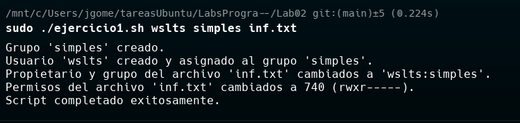
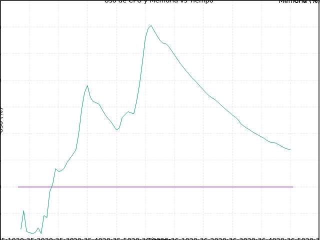
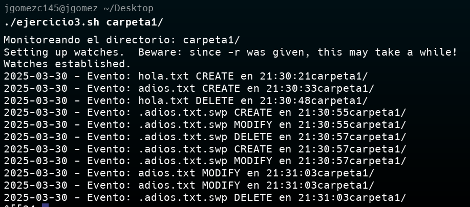
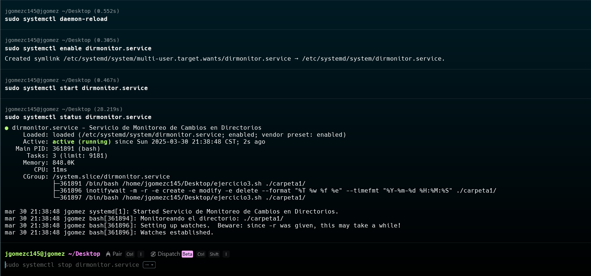

# Laboratorio #2 - Programación Bajo Plataformas Abiertas (IE-0117)

Este repositorio contiene los scripts desarrollados para el Laboratorio #2 del curso **Programación Bajo Plataformas Abiertas** de la Universidad de Costa Rica.

> [!IMPORTANT]
> Este archivo README.md es un resumen de los ejercicios realizados. No debe considerarse como manual, ni mucho menos como el reporte.

> [!CAUTION]
> Puede que al ejecutar los scripts no funcionen como se espera. Los archivos fueron creado en un sistema MSDOS. Si estos no funcionan se recomienda usar dos2unix para convertir los archivos a un formato UNIX. 

## 📋 Contenido

- [Ejercicio 1: Usuarios, Grupos y Permisos](#ejercicio-1)
- [Ejercicio 2: Monitoreo de Procesos](#ejercicio-2)
- [Ejercicio 2b: Gráfico de Logs](#ejercicio-2b)
- [Ejercicio 3: Monitoreo de Directorios](#ejercicio-3)

---

## Ejercicio 1

### Descripción
Este script (`ejercicio1.sh`) permite gestionar usuarios, grupos y permisos en un archivo. Realiza las siguientes tareas:
- Crea usuarios y grupos si no existen.
- Modifica la pertenencia y permisos de un archivo específico.
- Genera logs detallados.

### Uso
```bash
sudo ./ejercicio1.sh <usuario> <grupo> <ruta_al_archivo>
```
### Ejemplo
```bash
sudo ./ejercicio1.sh juan estudiantes /home/juan/documento.txt
```
### → Demo
```bash
sudo ./ejercicio1.sh wslts simples inf.txt
```
### ← Salida Demo
```bash
Grupo 'simples' creado.
Usuario 'wslts' creado y asignado al grupo 'simples'.
Propietario y grupo del archivo 'inf.txt' cambiados a 'wslts:simples'.
Permisos del archivo 'inf.txt' cambiados a 740 (rwxr-----).
Script completado exitosamente.
```



---

## Ejercicio 2

### Descripción
El script (`ejercicio2.sh`) ejecuta un proceso indicado por el usuario y monitorea continuamente su uso de CPU y Memoria.

### Uso
```bash
./ejercicio2.sh <comando>
```
### Ejemplo
```bash
./ejercicio2.sh firefox
```
### Salida
Genera un archivo `log.txt` con el uso de CPU y memoria durante la ejecución del proceso.

> [!WARNING]
> Requiere la dependencia `gnuplot` para graficar los datos. Asegúrate de tenerlo instalado antes de ejecutar el script.

### → Demo
```bash
./ejercicio2.sh firefox
```

### ← Salida Demo
```bash
Proceso 'firefox' iniciado con PID #######.
...
2025-03-30 20:35:16  0.0  0.0
2025-03-30 20:35:17 12.0  0.0
2025-03-30 20:35:18 15.5  0.0
2025-03-30 20:35:19 11.6  0.1
2025-03-30 20:35:21 11.2  0.5
2025-03-30 20:35:22 11.4  0.7
2025-03-30 20:35:23 12.3  1.3
2025-03-30 20:35:24 11.2  1.3
...
```
> [!NOTE]
> El PID puede variar según el proceso y el sistema. El 

> [!IMPORTANT]
> El script no se detiene solo a menos que el proceso acabe o se interrumpa manualmente.

### ← Salida Demo (Gráfico)


---

## Ejercicio 2b

### Descripción
Este script (`ejercicio2b.sh`) genera un gráfico con `gnuplot` a partir de un archivo de log generado por `ejercicio2.sh`.

> [!WARNING]
> Requiere la dependencia `gnuplot` para graficar los datos. Asegúrate de tenerlo instalado antes de ejecutar el script.

### Uso
```bash
./ejercicio2b.sh <archivo_log>
```
### Ejemplo
```bash
./ejercicio2b.sh log1.txt
```

> [!TIP]
> Puedes usar el script `ejercicio2.sh` para generar el archivo de log y luego usar `ejercicio2b.sh` para graficar los datos. Si se desea ver sin tener que volver a monitorizar el proceso.

---

## Ejercicio 3

### Descripción
El script (`ejercicio3.sh`) monitorea continuamente un directorio en busca de eventos de:
- Creación de archivos.
- Modificación de archivos.
- Eliminación de archivos.

Los eventos son registrados en un archivo llamado `directorio_monitoreo.log`.

### Uso
```bash
./ejercicio3.sh <ruta_del_directorio>
```
### Ejemplo
```bash
./ejercicio3.sh /home/usuario/mi_directorio
```

> [!WARNING]
> Requiere la dependencia `inotify-tools` para monitorear el directorio. Asegúrate de tenerlo instalado antes de ejecutar el script.

### → Demo
```bash
./ejercicio3.sh /carpeta1/
```
### ← Salida Demo
```bash
Monitoreando el directorio: carpeta1/
2025-03-30 - Evento: hola.txt CREATE en 21:30:21 carpeta1/
2025-03-30 - Evento: adios.txt CREATE en 21:30:33 carpeta1/
2025-03-30 - Evento: hola.txt DELETE en 21:30:48 carpeta1/
2025-03-30 - Evento: .adios.txt.swp CREATE en 21:30:55 carpeta1/
2025-03-30 - Evento: .adios.txt.swp MODIFY en 21:30:55 carpeta1/
2025-03-30 - Evento: .adios.txt.swp DELETE en 21:30:57 carpeta1/
```


---

## Servicio Systemd (`dirmonitor.service`)

Este servicio se encarga de iniciar automáticamente el monitoreo del directorio especificado mediante el script `ejercicio3.sh`.

### Archivo del Servicio
```ini
[Unit]
Description=Servicio de Monitoreo de Cambios en Directorios
After=network.target

[Service]
Type=simple
ExecStart=/bin/bash /ruta/a/tu/ejercicio3.sh /ruta/a/tu/directorio
WorkingDirectory=/ruta/a/tu
Restart=always

[Install]
WantedBy=multi-user.target
```

### Instalación del Servicio
```bash
sudo cp dirmonitor.service /etc/systemd/system/
sudo systemctl daemon-reload
sudo systemctl enable dirmonitor.service
sudo systemctl start dirmonitor.service
```

### Verificación del Servicio
```bash
sudo systemctl status dirmonitor.service
```



---

## Requisitos del Sistema

- Linux con soporte para `systemd`.
- `inotify-tools` instalado:
  ```bash
  sudo apt-get install inotify-tools
  ```
- `gnuplot` instalado para graficar datos:
  ```bash
  sudo apt-get install gnuplot
  ```

---

## Licencia
Este proyecto es de uso educativo para el curso **IE-0117 Programación Bajo Plataformas Abiertas**. Nótese que su reproducción no está autorizada.


