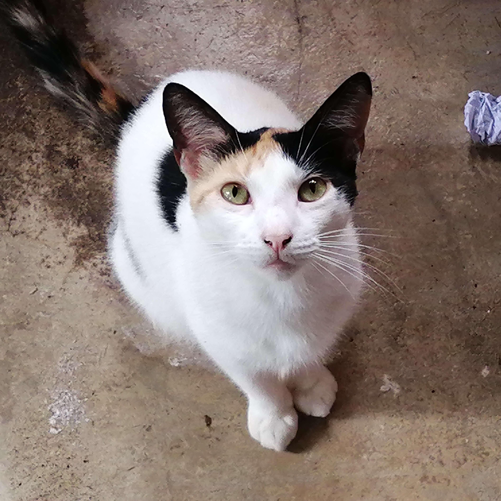

# LabsProgra--
### Author: ~~JGomezC145 (Jeremy Gomez Cortes)~~ Waffle
### Carné: C23264

 
Hola, me llamo Waffle pero a veces me dicen Gussy. De momento no hay un README.md general para todo el repositorio pero ya se verá. 

En este repositorio se encuentran los laboratorios del curso, aunque el README.md no está hecho, se pueden ver los laboratorios en las carpetas ¡Y cada uno sí tiene su README.md! Cada caperta de laboratorio tiene los ejercicios que se han hecho en cada uno de ellos. El README.md de cada carpeta tiene una breve descripción de lo que se ha hecho en cada uno de los ejercicios. Ademas está decorado, chizz. 

> [!IMPORTANT]
> Waffle dice este README.md no está hecho, pero ya se verá.

> [!DANGER]
> Meow!

